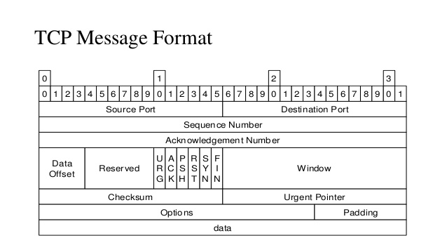

> Socket编程是网络编程中的重中之重，.NET为我们提供了丰富，详细的类库为我们使用C#进行Socket编程提供帮助，这里作为学习，会尽可能使用相对基础的Socket类库，来完成整个程序的构建，首先我们来了解Socket，因为是直接学习Socket，对于更底层的协议不会推进得那么深入彻底，主要会介绍一些相对重要的概念

## 了解TCP协议

### 先看结论

TCP协议是面向**连接**的，**可靠**的传输层协议

### 什么是连接

这里的连接不是指我们用网线进行的物理的连接，而是指一种逻辑上的连接，双方可以通过某种方式，访问到对方的资源，就称之为连接。

### 为什么可靠

为了了解，或者说印证这个结论，先让我们了解TCP的报文格式，**报文**(message)，用百度百科上的话来说，是

> 报文(message)是网络中交换与传输的数据单元，即站点一次性要发送的数据块。报文包含了将要发送的完整的数据信息，其长短很不一致，长度不限且可变。

通俗的说，就是通信双方在通信中每次要发送的数据，这个整体，我们称之为报文，我们先来看一个TCP报文的格式

从左上部分到右下部分依次开始了解：

**Source Port & Destination Port**：端口号 - 源计算机上应用程序的端口号和目标计算机上应用程序的端口号，都分别占16位

**Sequence Number**：序列号 - 32位无符号整数，在TCP传输中，传输的字节流中的每个字节都会被编号，当`SYN`(后面会介绍什么是SYN)为1时，即建立连接时，这个字段的值是一个初始值，也被称为**ISN(initialization sequence number)**，当`SYN`不为1时，是传输数据段中第一个字节的序列号

**Acknowledgement Number**：确认号 - 也是32位无符号整数，表示接受方期望收到发送方下一个报文数据段的第一个字节数据的编号，其值是接收计算机即将接收到的下一个序列号

**Data Offset**：数据偏移量 - 占4位，指数据段中的需要的数据部分起始处距离TCP数据段的字节偏移量，告诉接收端的应用程序，数据从何处开始

**Reserved**：保留字段，占4位，为TCP将来的发展预留空间，目前必须全部为0

**标志位字段**：

- `CWR`（Congestion Window Reduce）：拥塞窗口减少标志，用来表明它接收到了设置 `ECE` 标志的 TCP 包。并且，发送方收到消息之后，通过减小发送窗口的大小来降低发送速率。

- `ECE`（ECN Echo）：用来在 TCP 三次握手时表明一个 TCP 端是具备 ECN 功能的。在数据传输过程中，它也用来表明接收到的 TCP 包的 IP 头部的 ECN 被设置为 11，即网络线路拥堵。

- `URG`（Urgent）：表示本报文段中发送的数据是否包含紧急数据。URG=1 时表示有紧急数据。当 URG=1 时，后面的紧急指针字段才有效。

- `ACK`：表示前面的确认号字段是否有效。ACK=1 时表示有效。只有当 ACK=1 时，前面的确认号字段才有效。TCP 规定，连接建立后，ACK 必须为 1。

- `PSH`（Push）：告诉对方收到该报文段后是否立即把数据推送给上层。如果值为 1，表示应当立即把数据提交给上层，而不是缓存起来。

- `RST`：表示是否重置连接。如果 RST=1，说明 TCP 连接出现了严重错误（如主机崩溃），必须释放连接，然后再重新建立连接。

- `SYN`：在建立连接时使用，用来同步序号。当 SYN=1，ACK=0 时，表示这是一个请求建立连接的报文段；当 SYN=1，ACK=1 时，表示对方同意建立连接。SYN=1 时，说明这是一个请求建立连接或同意建立连接的报文。只有在前两次握手中 SYN 才为 1。

- `FIN`：标记数据是否发送完毕。如果 FIN=1，表示数据已经发送完成，可以释放连接。

  

让我们详细聊聊*Sequence Number*，在每次

在TCP中通过三次握手来完成连接，经过三次握手之后，双方会在内存开辟相应的**资源**(结构体，缓冲区等)

为什么握手是三次，首先通信是双向的，客户端和服务端都有输入流，也有输出流，对于客户端来说，发一个数据去对面，对面也返回一个数据到我这里，证明客户端这边的通信是通的，对于服务端来说，收到对面的数据，证明输入是通的，此时回复一个包，对面收到之后再回复一个包，此时服务端才知道，自己的输出也是通的，这是一个**确认机制**，这确保了传输的可靠性，连接完成之后，连接双方可以进行数据发送，发送完成之后，通过四次分手机制，可以断开连接

为什么需要分手，为什么是四次：双方需要释放资源

从握手 - 传输 - 分手，是一个完整的过程，否则会导致资源不能被正确开辟或者没有被正确释放

## 在Linux系统中用指令获取百度首页

`exec 5<> /dev/tcp/www.baidu.com/80`

创建一个socket通信，内核内部完成

`echo -e  "GET / HTTP/1.0\n" >&5`

用户空间的实现应用层协议

`cat <& 5`

早期HTTP请求

每次都建立三次握手，传输数据，四次挥手

无状态：HTTP 1.1开始，可以keep-alive

## Socket是什么

### 概念浅析

Socket直译成“孔”或“插座”，作为进程之间的一种通信机制，通常也被称为“套接字”，是用于描述IP地址和端口号的通信链的句柄。

要满足套接字这个概念，必须给出四个元组，一端的Ip+port 和另一端的ip+port，是在整个互联网中唯一表示的，唯一表示互联网中两个程序之间的通信 ，操作系统可以分配的最大的端口号是65535

问：当一台服务器已经和另一台服务器建立了65535个连接之后，还能不能和其它服务器建立连接

答：能，因为连往的IP是不同的，还是能唯一表示不同的通信

问：如果服务器就一台，另一台物理服务器要对其进行一个压力测试，测试其并发数，要怎么做

答：使用虚拟IP，不断用不同的IP去与其建立连接

通俗的讲，人与人之间可以通过打电话来进行通信，程序与程序之间要进行通信，互相收发数据，就需要通过Socket来通信，所以不难理解为什么需要描述IP地址和端口号，把电话区号当作IP地址，后面的部分当作端口号，这样构成的一个完整的 电话号码，才能和确切的某一个人进行通话，

在这个过程中，协议可以理解成打电话时双方沟通时用的语言，这篇里简单了解，TCP协议是面向连接的，是流式(STREAM)的，每次传输都需要建立三次握手，确保通信过程不会出现数据丢失

UDP协议是无连接的，是数据报式(DATAGRAM)的，不安全(丢失，顺序混乱，在接收端要分析重排及要求重发)，但效率高，在传输视频的时候通常使用UDP

### 一般应用模式

1.	服务端Socket开始监听端口，负责监听客户端连接信息
2.	客户端Socket连接服务端指定端口
3.	服务端监听到客户端连接，创建Connection Socket(负责和客户端通信的Socket)，开始进行通信

也就是说，在这个过程中，这里服务端有两个Socket，一个负责监听，一个负责通信，客户端从始至终只有一个Socket

> 这里通过打电话的例子，也有助于快速理解，通话双方都需要有电话(Socket)，通过电话号码(IP+端口号)呼叫对方，建立连接，开始通话

### 使用C#的Socket类进行Socket通信

这里直接上手写代码，之后会回来补上流程图和介绍等