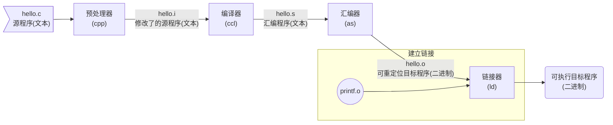

> 《深入理解计算机系统》这本书，按照书本的前言，主要读者是计算机科学家、计算机工程师，以及那些想通过学习计算机系统的内在运作而能写出更好程序的人，想要更多的了解计算机系统相关的知识，并且想要成为这样的人，所以我们开始了本书的学习


## 计算机系统漫游

> `计算机系统`是由硬件和系统软件组成的，系统的具体实现方式随时间不断变化，但是内在的概念是不变的。所有计算机系统由相似的硬件和软件组成，并执行相似的功能。通过一个hello程序被创建，到在系统上运行，输出消息，然后终止，这一整个生命周期，我们开始对计算机系统的学习

### 信息就是位+上下文

首先，我们在编辑器中创建了一个文本文件`hello.c`，*hello*程序的生命周期从这里开始：
```c
#include <stdio.h>
int main()
{
    printf("hello, world\n");
    return 0;
}
```

这个源程序(或者说源文件)实际上就是由0和1组成的位(又称为比特)序列，8个位被组织成一组，称为`字节`。每个字节表示程序中某些文本字符。

比如上面的`hello.c`代码，其*ASCII码[^1]*表示的内容为


像这样符合某种文字编码规范的文件称为文本文件，所有其他文件都称为二进制文件，书中提到了这样的区别，其实广义的二进制文件包括了文本文件，二者只是在逻辑上经常被做了区分，在查阅资料后我认为，没有必要过于深入探究这两者之间的区别，只要记住符合某种文字编码规范的就是文本文件就可以了

这个文件的表示方法说明了一个基本思想：所有的文件，包括磁盘中的文件，内存中的程序，内存中的用户数据以及网络上传输的数据，都是由一串位(比特)表示的，区分不同数据的唯一方法是根据读到它们时它们的上下文来判断，因为在不同的上下文中，一个同样的字节序列可能表示一个整数、浮点数、字符串或者机器指令

> 小知识：C语言的起源 —— C语言是贝尔实验室的*Dennis Ritchie*在1969年 - 1973年之间创建的。美国国家标准学会(*American National Standards，ANSI)*在1989年颁布了ANSI C的标准，后来C语言的标准化成了国际标准化组织*International Standards Organization，ISO*)的责任。
>
> 这些标准定义了C语言和一系列函数库，即C标准库。*Kernighan*和*Ritchie*在它们的经典著作中描述了ANSI C，这本书大家满怀感情地称为"K&R"。
>
> C语言会取得成功的原因有：
>
> - **C语言与Unix操作系统关系密切**。C从一开始就是作为用于Unix系统的程序语言被开发出来的，由于20世纪70年代到80年代初Unix在高校中的流行，很多人开始接触C并且喜欢上它
> - **C语言小而简单**。C语言最初的设计是由一个人而非一个协会掌握的，因此简洁明了，没有什么冗赘的设计。这让C语言相对易于学习，也易于移植到不同的计算机
>
> C语言是系统及编程的首选，同时也很适合编写应用级程序。不过其也存在一些不足，比如容易造成程序员困惑和程序错误的C语言指针。以及缺乏对类，对象等的显式抽象能力。


### 程序被其他程序翻译成不同的格式

之前我们编写的`hello.c`程序是用高级语言来表述的，容易被人读懂。为了在系统上运行它，这些语句必须被其他程序转化为相对低级的*机器语言指令*，然后按照一种称为*可执行目标程序*的格式被打好包，并且保存为二进制磁盘文件，也被称为*可执行目标文件*

在Unix系统上，从源文件到目标文件的转换是由编译器驱动程序完成的：

```bash
linux> gcc -o hello hello.c
```

以GCC编译器驱动程序[^2]编译过程为例，整个编译分为四个阶段，而执行这四个阶段的程序共同构成了*编译系统(complilation system)*




可以看到，四个阶段分别为：

- **预处理阶段**：预处理器(cpp)根据以字符#开头的命令修改原始的C程序，比如第一行的`#include <stdio.h>`，预处理器会读取系统头文件，并且直接插入到程序文本中，得到另一个C程序，以`.i`作为扩展名

- **编译阶段**：编译器(ccl)把文本文件`hello.i`翻译成文本文件`hello.s`，其包含一个**汇编语言程序**，内容为：

  ```assembly
  main:
  	subq  $8, %rsp
  	movl  $.LCO, %edi
  	call  puts
  	movl  $0, %eax
  	addq  $8, %rsp
  	ret
  ```

  汇编语言用文本格式描述了低级机器语言指令。汇编语言的作用在于，其为不同的高级语言的不同编译器提供了通用的输出语言。
  
- **汇编阶段**：接下来，汇编器(as)把`hello.s`翻译成机器语言指令，并把指令打包成*可重定位目标程序(relocatable object program)*，保存在目标文件`hello.o`中，这是一个二进制文件，用文本编辑器打开它时，我们将看到一堆乱码

- **链接阶段**：因为`hello`程序调用了`printf`函数，它是每个C编译器都提供的标准C库中的一个函数，该函数位于一个已经预编译好了的`printf.o`文件中，所以这个文件必须以某种方式合并到我们的`hello.o`程序中，链接器(ld)负责处理这种合并。最后得到`hello`文件(在Windows系统中，通常会编译成以`.exe`为扩展名的文件)，它是一个`可执行目标文件`


> 小知识：GCC是GNU(GUN's Not Unix)项目开发出来的众多有用工具之一，这个项目是1984年由*Richard Stallman*发起的一个慈善项目。项目的目标是开发出一个完整的类Unix的系统，并且该系统的源码能不受限制地被修改和传播。GNU项目已经开发出了一个包含Unix操作系统的所有主要部件的环境，除了内核，内核是由Linux项目独立发展而来的。


学了上面的小知识，才终于知道原来Linux本身只是一个内核，但是因为Linux内核和GNU项目的软件都是成套出现的，所以就被人简称为Linux，其全称为GNU/Linux，光有一个Linux内核是没办法使用的，没有软件也没有交互。再把软件加进来还是不能用，因为这些软件都是以源代码的形式发布的，需要编译成二进制程序，而且需要做调配选择，这些工作是发行版制作者的工作。

比较异类的基于Linux内核的操作系统有Android，因为除了内核，其他运行的软件基本都是Google自己的，而不是GNU项目的；另外还有比较异类的如Debian的GNU/Hurd，其实Hurd才是GNU自己的内核，不过因为*Richard*无止境寻找完美内核，而忘记了Hurd主要目的是为了提供一个可用的操作系统内核，给了Linux机会。弄得GNU项目的人只能让自己的软件运行在Linux内核上[^3]


> GUN环境包括EMACS编辑器、GCC编译器、GDB调试器、汇编器、链接器、处理二进制文件的工具以及一些其他部件。GCC编译器已经发展到支持不同的语言，包括C、C++、Fortran、Java、Pascal、Objective-C和Ada
>
> GNU项目取得了非凡的成绩，但是却常常被忽略。现代开放源码运动(通常和Linux联系在一起)的思想起源是GNU中自由软件(free software)的概念，可想而知GNU项目对于开源的奠基地位

### 了解编译系统工作原理的好处

作为一名程序员，有许多理由不去了解编译系统是如何工作的，但我们还是有必须知道其工作原理的原因：

* **优化程序性能**：了解编译原理能让程序员在写代码时有做出更好的编码选择的能力，比如，如果了解了编译器将不同的C语言转化为机器代码的方式，就能搞清楚在实现效果一样的情况下，如何在`swich`和一连串的*if-else*之间，在`while`和`for`之间做选择。以及了解一个函数调用的开销有多大，为什么循环求和时把结果放到本地变量比放到一个通过引用传递过来的参数速度更快
* **理解链接时出现的错误**：有助于让程序员避开那些非常令人困扰的链接器操作
* **避免安全漏洞**：一个稳定的，不容易出问题的软件需要程序员具有对程序做限制的能力，不仅有业务上的一些限制，更包括程序运行时对系统资源调用的限制。学习安全编程的第一步就是理解数据和控制信息存放在程序栈上的方式会引起的后果，了解程序的内部原理有助于避免这些安全问题

### 处理器读取并解释内存中的命令

此时，我们已经有被编译系统翻译完成的`hello`文件，并被存放在磁盘上，现在我们使用名为`shell`的应用程序来运行它

```shell
linux> ./hello
hello, world
linux>
```

#### 系统的硬件组成

书里会分阶段对一个典型系统的硬件组织进行介绍，但是在这一章会带我们做一个了解，以便让我们知道运行`hello`程序时发生了什么

1. **总线**

   总线是贯穿整个系统的一组电子管道，其携带字节并负责在各个部件间传递。通常被设计成传送定长的字节块，也可以说成字(word)。其中的字节数(字长)在各个系统中都不一样，要么是4个字节(32位)，要么是8个字节(64位)

2. **I/O设备**

   I/O(输入/输出)设备是系统和外部世界的通道，之后的示例中会有四个I/O设备：键盘鼠标，显示器，磁盘。最开始，我们的这个程序就是放在磁盘上的。每个I/O设备都通过一个控制器或者适配器[^4]与I/O总线相连。


3. **主存**

   主存是一个临时存储设备，在处理器执行程序时用来存放程序和程序处理的数据。从物理上来说，其是由一组动态随机存储器(DRAM)芯片组成的。从逻辑上来说，其是一个线性的字节数组，每个字节都有唯一的地址(数组索引)，一般来说，组成程序的每条机器指令都由不同数量的字节构成。与C程序变量相对应的数据项的大小是根据类型变化的。比如，在运行Linux的x86-64机器上，`short`类型需要2个字节，`int`和`float`类型需要4个字节，而`long`和`double`类型需要8个字节

4. **处理器**

   中央处理单元(CPU)，是解释(或执行)存储在主存中指令的引擎。其核心是大小为一个字(前文在总线那里提到过这个概念)的存储设备(或寄存器)，称为程序计数器(PC)，在任何时刻，PC都指向主存中某条机器语言指令(即含有该条指令的地址)
   
   从系统通电到断电，处理器一直在不断执行程序计数器指向的指令，并更新计数器，使其指向下一条指令
   
   处理器按照一个非常简单的指令模型来操作，这个模型由*指令集架构*决定。在这个模型中，指令按照严格的顺序执行，而每条的执行又包含一定的步骤。
   
   处理器从程序计数器指向的内存读取指令，解释指令中的位，执行该指令指示的简单操作，然后更新PC，使其指向下一条指令，这条指令和在内存中刚刚执行的指令不一定是相邻的

这些操作围绕着主存、寄存器文件(register file)和算数/逻辑单元(ALU)进行。寄存器文件是一个小的存储设备，由一些单个字长的寄存器[^5]组成，每个寄存器都有唯一的名字。ALU计算新的数据和地址值，CPU在指令的要求下可能会执行的操作有：

- **加载**：从主存赋值一个字节或者一个字到寄存器，以覆盖寄存器原来的内存
- **存储**：从寄存器赋值一个字节或者一个字到主存的某个位置，覆盖掉这个位置原来的内容
- **操作**：把两个寄存器的内容赋值到ALU，ALU对这两个字做算数运算，并将结果放到一个寄存器中，覆盖该寄存器中原来的内容
- **跳转**：从指令本身中抽取一个字，并将这个字赋值到程序计数器(PC)，覆盖PC中原来的值

  看上去处理器简单实现了它的指令集架构，但是实际上现代处理器为了加速程序执行，使用了非常复杂的机制。所以我们这里把指令集架构和处理器的为体系结构区分讨论，指令集架构描述的是每条机器代码指令的效果，具有一定的抽象性。而微体系结构描述的是实际上是如何实现的。

#### 运行hello程序

首先我们在键盘上输入字符串`./hello`时，shell程序将字符逐一读入寄存器，再把它放到内存中


当在键盘上敲回车键时，shell程序知道了我们已经结束了指令的输入，于是其加载可执行的hello文件，这些指令将hello目标文件的代码和数据(包括最后会被输出的字符串"hello, world\n")从磁盘复制到主存

利用直接存储器存取(DMA，书本后面会讨论)技术，数据可以不通过处理器而直接从磁盘到达主存


当目标文件hello中的代码和数据被加载到主存后，处理器就开始执行hello程序的main程序中的机器语言指令。这些指令将"hello, world\n"字符串中的字节从主存复制到寄存器文件，再从寄存器文件复制到显示设备，最后显示在屏幕上


### 高速缓存的重要性

从这个示例可以看出，系统花费了大量的时间把信息从一个地方挪到另一个地方。这些复制作为开销，减慢了程序"真正"的工作。因此系统设计者的一个主要目标是让这些复制操作尽快完成

根据机械原理，较大的存储设备比较小的存储设备运行得慢，对处理器而言，从磁盘驱动器上读取一个字的时间开销要比从主存中读取的开销大1000万倍，从寄存器文件中读数据比主存中读取几乎要快100倍，而且这个差距随着半导体技术的进步还在持续增大

针对这种处理器与主存之间的差异，系统设计这使用了更小更快的*高速缓存存储器(cache memory，简称为cache或高速缓存)*作为暂时的集结区域，存放处理器近期可能会需要的信息。一个典型系统中通常有位于处理器芯片上的*L1高速缓存器*，容量可以达到数万字节，访问速度几乎和访问寄存器一样快。L2缓存器通过一条特殊的总线连接到处理器。高速缓存是用一种叫做**静态随机访问存储器(SRAM)**的硬件技术实现的。比较新，处理能力更强大的系统还可能有三级高速缓存，L1，L2和L3。利用高速缓存的**局部性**原理，即程序具有访问局部区域里的数据和代码的趋势，系统可以获得一个很大的存储器，同时访问速度也很快。


### 存储设备形成层次结构

在处理器和一个较大较慢的设备(如内存)之间插入一个更小更快的存储设备(如高速缓存)的想法已经成为一个普遍的观念。每个计算机中的存储设备被组织成一个**存储器层次结构**，在这个层次结构中，从上到下，设备的访问速度越来越慢、容量越来越大，每字节的造价也越来越便宜


存储器的层次结构的主要思想是上一层的存储器作为低一层存储器的高速缓存。在某些具有分布式文件系统的网络系统中，本地磁盘就是存储在其他系统中磁盘上的数据的高速缓存

利用对整个存储器层次结构的理解，可以提高程序性能。本书后面会更详细讨论这个问题

### 操作系统管理硬件

当shell加载和运行`hello`程序，以及`hello`程序输出自己的消息时，shell和`hello`程序都没有直接访问键盘、显示器或者主存。它们依靠操作系统提供的服务来完成这个过程。可以把操作系统看作是应用程序和硬件之间的一层软件，所有应用对硬件的操作尝试都必须通过操作系统，操作系统有两个基本功能：

1. 防止硬件被时空的应用程序滥用；
2. 向应用程序提供简单一致的机制来控制复杂而又通常大不相同的低级硬件设备。通过几个基本的抽象概念(进程、虚拟内存和文件)来实现这两个功能。


#### 进程

当`hello`程序运行时，操作系统会提供一种假象，好像系统上只有这个程序在运行(在linux系统中，界面上只能观察到这个程序在运行)。就好像它独占了所有的硬件设备，处理器在不间断地执行程序中的指令，而该程序的代码和数据是系统内存中唯一的对象。这种现象是通过进程的概念来实现的。

进程是操作系统对一个正在运行的程序的一种抽象。并发运行，指的是一个进程的指令和另一个进程的指令是交错的。无论是单核还是多核系统，一个CPU看上去都像是在并发地执行多个进程，这通过处理器在进程间切换来实现。操作系统中实现这种交错执行的机制被称为*上下文切换*。

操作系统保持跟踪进程运行需要的所有状态信息，这种状态，也就是上下文，里面包含了许多信息，比如PC和寄存器文件的当前值，以及主存的内容。在任何一个时刻，单处理器系统都只能执行一个进程的代码。当操作系统决定要把控制权从当前进程转移到某个新进程，就会进行上下文切换，即保存当前进程的上下文、恢复新进程的上下文，然后将控制权传递到新进程，新进程从上次停止的地方继续。


从一个进程到另一个进程的转换是由操作系统内核(kernel)管理的。控制权在进程A -> 内核 -> 进程B ……来回传递。内核不是一个独立的进程，它是系统管理全部进程所用代码和数据结构的集合。


#### 线程

一个进程可以由多个称为线程的执行单元组成，线程在进程的上下文中共享同样的代码和全局数据，因为多线程之间比多进程之间更容易共享数据，而且一般比进程更高效。所以有多处理器可用的时候，多线程也是一种使得程序可以运行得更快的方法。


#### 虚拟内存

虚拟内存是一个抽象概念，每个进程看到的内存都是一致的，称为虚拟空间地址，地址最上面的区域是保留给操作系统中的代码和数据的，对所有进程来说都是一样的。地址空间的底部区域存放用户自定义的进程的代码和数据。地址是从下往上增大的。


从最低的内存地址开始，简单了解一下虚拟内存的各个区：

- **程序代码和数据**：对所有进程来说，代码是从同一个固定地址开始，紧接着是和C全局变量相对应的数据位置，这个区域是直接按照可执行目标文件的内容初始化的
- **堆**：代码和数据区后面紧跟着运行时堆。和代码和数据区不一样，这个区不是固定大小的，而是可以动态地扩展和收缩
- **共享库**：地址空间的空间部分有一块用来存放C标准库，数学库等共享库的代码和数据的区域
- **栈**：位于用户虚拟地址空间顶部，编译器用它实现函数调用。其也可以动态地扩展和收缩。当我们调用一个函数时，其会增长；从一个函数返回时，栈就会收缩
- **内核虚拟地址**：地址空间顶部的区域，是为内核保留的，不允许应用程序独写这个区域的内容或者直接调用内核代码定义的函数，它们必须通过内核来执行这些操作

虚拟内存的运作需要硬件和操作系统之间精密复杂的交互。


#### 文件

文件就是字节序列，仅此而已。每个I/O设备，磁盘、键盘、显示器，甚至网络，都可以看成是文件。系统中所有输入输出都通过一小组称为Unix I/O的系统函数调用读写文件来实现

文件这个简单而精致的概念非常强大。它向应用程序提供了一个统一的视图，来看待系统中可能含有的所有各式各样的I/O设备


### 系统之间通过网络通信

现代系统经常通过网络和其他系统连接到一起。从一个单独的系统看，网络可视为一个I/O设备。当系统从主存复制一串字节到网络适配器，数据流经过网络到达另一台机器，而不是到达本地磁盘驱动器。同样，也可以读取从其他机器发送来的数据，并把数据复制到自己的主存


### 重要主题

通过前面所有的漫游内容，我们可以得出一个很重要的观点，那就是系统不仅仅只是硬件。而是硬件和系统软件互相交织的集合体，它们必须共同协作以达到运行应用程序最终的目的。

通过之后对这些知识的深入学习，可以帮助我们写出更快速、更可靠、更安全的程序。

#### Amdahl定律

*Gene Amdahl*，对提升系统某一部分性能所带来的效果做出了观察，这个观察被称为*Amdahl定律(Amdahl's law)*。该定律主要思想是：

当我们对系统的某个部分加速时，其对系统整体性能的影响取决于该部分的重要性和加速程度。

> 假如原本执行某应用程序需要的时间为Told。假设系统某部分所需执行时间与该时间的比例为a，该部分的性能提升比例为k。则该部分初始所需时间为aTold，现在所需时间为(a*Told)/k，因此，总的执行时间应为


上面是书里对*Amdahl定律*的解释，看完之后是不是觉得还有一点不明白是什么意思，特别是这里是两个比例

这里再详细了解一下这个定律，首先这个定律在中文中通常被音译成*阿姆达尔定律*，阿姆达尔曾致力于并行处理系统的研究。把a看作并行计算部分所占比例，k为并行处理节点个数，假设a占100%，即1-a=0，整个程序都是并行执行时，k带来的收益是最高的。当a占0%，即整个程序都是串行执行时，无论如何增加k，都不会提高加速比。

还有一种情况，考虑k趋向于∞时的效果，可以看出，此时a/k几乎可以忽略不计，于是我们得到：


如果百分之60%的计算可以加速到几乎不花时间的程度，我们获得的加速比仍然只有1/0.4=2.5X[^6]

阿姆达尔定律描述了改善任何过程的一般原则，其主要观点是：想要显著加速整个系统，必须提升全系统中相当大的部分的速度。这个定律除了可以用在加速计算机系统方面，还可以用在公司降低制造成本，或者学生提高绩点平均值等方面。

可以看出，如果我们想提高一个程序的运行效率提高2倍或更高的比例，只有通过很大一部分系统的组件才能得到

书中有两道练习题：


贴上答题过程：


这也证明阿姆达尔定律不仅仅适用于计算机系统

#### 并发和并行

如果处理器能够同时做更多的事情，可想而知，计算机就可以运行做更多的事情，并且能做更多的事情。**并发(concurrency)**指一个同时具有多个活动的系统，**并行(parallelism)**则指的是用并发来使一个系统运行更快。并行可以在计算机的多个层次上使用。

1. 线程级并发

   在单处理器系统中，并发只是模拟出来的，是通过一台计算机在正在执行的进程间快速切换来实现的，称之为时间共享。随着多核处理器和超线程(hyperthreading)的出现，这种系统才变得常见

   

   多核处理器是将多个CPU(称为"核")集成到一个集成电路芯片上

   

   

   比如上面的微处理器芯片有4个核，每个核都有自己的L1和L2高速缓存，其中L1高速缓存分两部分：一个保存最近取到的指令，另一个存放数据。这些核共享更高层次的高速缓存，以及到主存的接口。工业界专家认为它们最后能把几十个甚至上百个核做到一个芯片上。

   超线程，有时被称为同时多线程(simultaneous multi-threading)，是一项允许一个CPU执行多个控制流的技术。在应用了超线程技术的CPU中，某些硬件，比如程序计数器和寄存器文件有多个备份，其他硬件部分只有一份。常规的处理器需要大约20,000个时钟周i做线程间的转换，而超线程的处理器在单个周期的基础上可以决定要执行哪一个线程。比如，假设一个线程必须等到某些数据被装载到高速缓存中，那CPU就可以继续去执行另一个线程。比如Intel Core i7处理器可以让每个核执行两个线程，所以一个4核的系统实际上可以并行地执行8个线程

   当程序是以多线程方式来书写的时候，多处理器的使用可以加快程序的运行，因为多个线程可以并行地高效执行。所以虽然并发原理的形成和研究已经超过50年的时间了，但是多核和超线程系统的出现，才激发了利用硬件开发线程级并行程序的应用程序的愿望。

2. 指令级并行

   在较低的抽象层次，现代处理器可以同时同时执行多条指令的属性称为*指令级并行*。现代处理器使用了很多聪明的技巧来同时处理多达100条指令。在书中之后的内容中，会讨论流水线(pipelining)的使用，它通过将执行一条指令需要的活动划分为不同的步骤，让处理器对指令的处理分为多个阶段，并行进行操作。

   如果处理器可以达到比一个周期一条指令更快的执行速率，就称之为*超标量(superscalar)*处理器。大多数现代处理器都支持超标量操作。

3. 单指令、多数据并行

   在最低层次上，许多现代处理器有特殊的硬件，允许一条指令产生多个可以并行执行的操作，这种方式被称为单指令、多数据，即SIMD并行。大多数时候提供这些SIMD指令多是为了提高处理影像、声音和视频数据应用的执行速度。

#### 计算机系统中抽象的重要性

抽象是计算机科学中最为重要的概念之一，比如为一组函数规定一个简单的应用接口(API)，程序员可以忽略它内部的工作便可以使用这些代码。对于计算机系统来说，底层的硬件远比抽象描述要复杂精细，在本章我们旋风式地对这些知识进行了了解，在后续的章节，会具体介绍这些抽象


### 小结

计算机系统由硬件和系统软件组成，它们共同协作以运行应用程序。计算机内部的信息被表示为一组组的位，它们根据上下文有不同的解释方式。程序被其他程序翻译成不同的形式，先到ASCII文本，然后被编译器翻译成二进制可执行文件。

处理器读取并解释主存里的二进制指令。应为计算机花费了大量的时间在内存、I/O设备和CPU寄存器之间复制数据，所以将系统中的存储设备分成层次结构，顶部是CPU寄存器，接着是多层的硬件高速缓存存储器、DRAM主存和磁盘存储器。位于更高层次的存储设备比底层存储设备要快，单位比总造价更高。层次结构中较高层次的存储设备可以作为较低层次设备的高速缓存。通过理解和运用这种存储层次结构的知识，程序员可以优化程序的性能。

操作系统内核是应用层序和硬件之间的媒介。它提供三个基本的抽象：

1. 文件是对I/O设备的抽象；
2. 虚拟内存是对主存和磁盘的抽象；
3. 进程是处理器、主存和I/O设备的抽象

最后，网络提供了计算机系统之间通信的手段，从特殊的角度来看，网络就是一种I/O设备

<br/><br/><br/><br/><br/><br/>

[^1]: ASCII码是用一个唯一的单字节大小的整数值来表示每个字符，还有许多其他编码方式用于表示非英语类语言文本，比如UTF-8标准，根据书中指引，本书后面会学习到
[^2]: 编译器驱动程序不止一种，相同的驱动程序在不同的系统上的行为过程大体是相同的，传统编译器的工作原理基本上都符合三段式：1.用于解析源码，检查语法错误，并将其抽象为语法树(Abstact Syntax Tree)的前端(Frontend)；2.对中间代码进行优化的优化器(Optimizer)；3.负责将优化后的中间代码转换为目标机器的机器码的后端(Backend)。现在用得比较多的LLVM编译器则与其具有一些区别，这个以后会在学习编译原理的时候学习，这里只是为了说明用GCC进行编译的过程在Unix和Windows上大体是相同的
[^3]: 关于这里有个网络上的梗：1990 年人们希望有一个可用的开源系统：Linux 可以用，Hurd 还不可以用；2000 年人们希望有一个稳定的开源系统：Linux 很稳定，Hurd 还很不稳定；2010 年人们希望有一个生态系统成熟的开源系统：Linux 生态系统很成熟，Hurd 还没有生态系统。Hurd 不成气候的原因，网友也分析出了这几点：1.RMS 的技术决定错误。微内核的优势是学术理论的结果，而不是从实际应用得出的经验。它的实现难度和设计难度也被低估，导致无法有效实施开发工作。2.和其他 GNU 项目不同，Hurd 的发展计划太长，实际执行更长。过于宏大长远的开源项目都很难成功。自由软件的成功之道是，大始于小，积土成堆。 3.GNU 没有搞出一款可用的操作系统。反而是 Redhat，Slackware，SUSE 和 Debian 这些后起之秀，短短几年就搞出了可用的开源操作系统。在此之上，前辈们迅速补齐了一个操作系统所需的各个部分，从包管理器，图形桌面到办公软件。之后人们就不再期待传说中的 GNU 操作系统了。4.GNU 的开发模式问题，虽是开源，但很集中。而 Linux 和 Mozilla 则受益于海纳百川的开放模式。可以参考《大教堂和集市》这本书。5.GNU 对自由软件的绝对洁癖。Linux 里面是有非开源的固件的，通常是由硬件厂商提供的。然而 GNU 是绝对不能认同这一实用主义做派的。因此 Hurd 如果要自己实现硬件驱动，那工作量就是无底洞，永远填不满。
[^4]: 控制器和适配器之间区别主要在于它们的封装方式。控制器是I/O设备本身或者系统的主印刷电路板(主板)上的芯片组。而适配器则是一块插在主板上的卡。无论如何，它们的功能都是在I/O总线和I/O设备之间传递信息
[^5]: 这里的寄存器要和前面提到的PC不是同一种东西，这里的寄存器是实实在在的寄存器。首先要明确，PC可以是实实在在的寄存器，也可以不是一个寄存器，书里提到这个概念只是想让人们明白在CPU体系里有一个用来存放指令地址的东西，在不同的指令集架构(x86，x64等)里面，它的称呼或者说法也可能不一样。这里不需要用太严格的理论来套实际的设计	
[^6]: 书里用X来表示加速比的单位，没有找到比较详细的介绍，这里也直接用X来表示