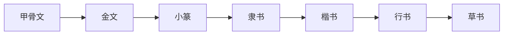

> 越来越发现全拼已经适应不了日常的中文打字需要了，所以开始学习五笔输入法，主要学习方式是通过[B站的视频](https://www.bilibili.com/video/BV1nx41177Mm)

## 五笔简介和原理

### 中国文字发展历史

以上的"甲金篆隶草楷行"七种字体被称为"汉字七体"，经过了6000多年的变化，其演变过程是循序渐进的

### 五笔输入法

五笔输入法是1983年王永民发明的一种中文输入法，所以现在我们所说的五笔输入法其实就是"王码五笔"，只是具体到不同的五笔输入法采用了王码的不同版本，它有重码少，简码和词组多，准确度高，便于盲打，输入速度快等优点

五笔字型主要分为三个版本：

86、98、新世纪，86版使用最广泛，虽然98版和新世纪版拆字更规范，但是因为86版先入为主，使用人数最多，输入法软件也最多，本次学习的版本也主要是基于86五笔来进行的

### 五笔组字原理

- 汉字都是由笔划或部首组成的，为了输入这些文字，我们把汉字拆成最常用的基本单位，叫做字根，字根可以是汉字的偏旁部首，也可以是部首的一部分，甚至是笔划
- 取出这些字根后，把它们按照一定的规律分；再把这些字根依据科学原理分配在键盘上
- 当需要输入汉字时，我们就按照汉字的书写顺序依次按与字根对应的键，组成一个代码；系统根据代码，在五笔输入法的字库中检索出索要的字显示在我们的电脑屏幕上

### 学习五笔需要掌握的知识

- 知道键盘上每个键对应的字根
- 学习如何把汉字拆成五笔字根
- 输入字根对应的字母，必要时键入识别码

## 汉字结构和字根介绍

**汉字有五种基本结构**：

1. 左右型：羽 汉 独 体 树
2. 上下型：泉 字 全 品 复
3. 独体字：本 五 子 已 王
4. 半包围：这 包 同 区 凶
5. 全包围：围 因 困 回 圆

五笔中只有三种结构，其中"左右型"和"上下型"和上面一样，3，4，5类型统称"杂合型"

**汉字有五种基本笔画**：

横竖撇捺折

有几个需要注意的点：

1. 提∈横，点∈捺   土/地  文
2. 左竖钩∈竖 木/条/杀
3. 初左竖钩外任何带拐弯的笔划都是属于折 乙/九/刀/匕/已
4. 有的点的方向是朝左的，不要误认为i是撇 刃/心

**字根**：

由几个笔划交叉连接组成的相对不变的结构

- 字根是组成汉字的基本单元
- 多数偏旁部首都属于字根
- 但是有些偏旁部首需要两个及以上字根组成

86五笔的字根有130个，如果算上某些字根的变体，约有200个，不要被这个数量所吓到，要有"麻烦一时，方便一世"的观念

## 五笔基础

首先，我们要了解几个概念

**键名汉字(25个)**：

Q金 W人 E月 R白 T禾 Y言 U立 I水 O火 P之

A工 S木 D大 F土 G王 H目 J日 K口 L田

X纟C又 V女 B子 N已 M山

打法：连续按四次相应的键位

介绍：它们是字根图上每个键左上角的黑体字；也是每句口诀的第一个字(X键除外)

**一级简码(一简，共25个)**：

Q我 W人 E有 R的 T和 Y主 U产 I不 O为 P这

A工 S要 D在 F地 G一 H上 J是 K中 L国

X经 C以 V发 B了 N民 M同

打法：打一次所在键位，然后按空格

介绍：它们是使用频率极高的字，必须记住

**单笔划**：

T 丿 Y丶 G一 H丨 N乙

介绍：这五个键很重要，是每个区的第一个键，也称单笔画键，在打成字字根时需要用到

打法：所在键位*2+LL，然后按空格键

**成字字根**：

有相当一部分字根本身就可以被用来作为常用的简单汉字(或偏旁)，它们被称为"成字字根"

打法：所在键位+第一笔+第二笔(+最后一笔)

特例(这几个字和我们的书写笔划是不一样的)：力(ltn) 乃(etn) 戈(agnt)