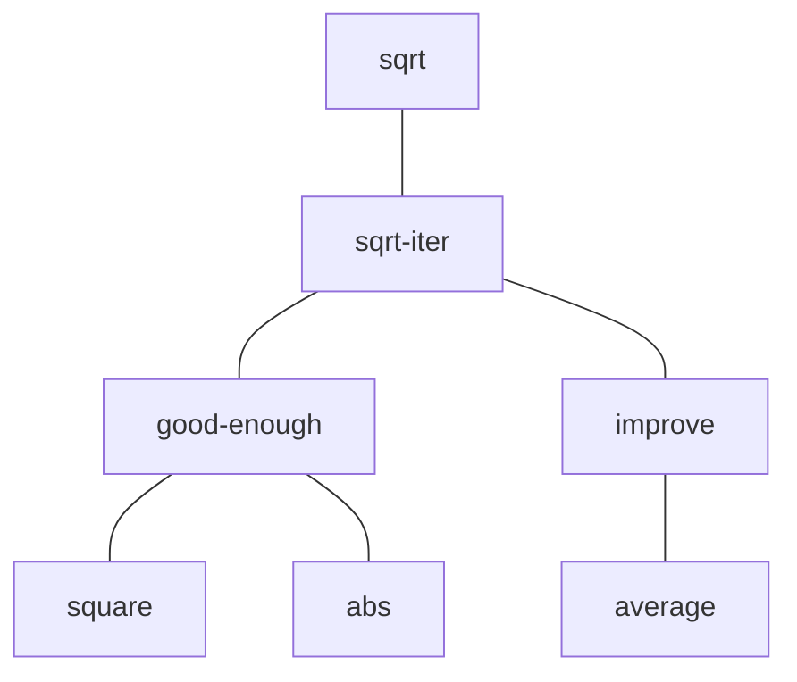
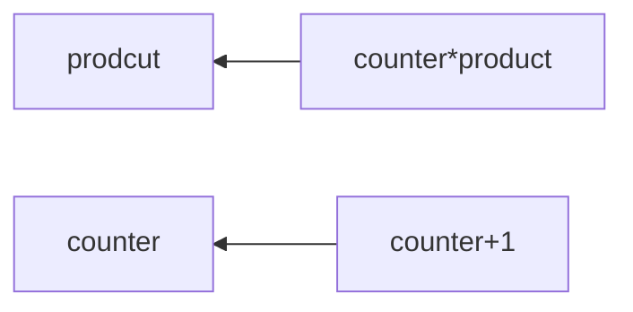

> 这本书是麻省理工学院计算机科学的入门教材，对于看完这本书的目标，前言中是这样描述的：完成了这一科目的学生能对程序涉及的风格要素有一种很好的审美观。他们应该掌握了控制大型系统的复杂性的主要技术。他们应该能够取读50页长的程序，只要该程序是以一种值得模仿的形式写出来的。他们应该知道在什么时候哪些东西不需要取读，哪些东西不需要去理解。他们应该很有把握地去修改一个程序，同时又能保持原来作者的精神和风格


以书中这一段非常出名的文字为起点开始我们的SICP学习之路：

> **计算机语言并不仅仅是一种让计算机去执行操作的方式，更重要的，它是一种表述有关方法学的思想的新颖的形式化媒介，因此，程序必须写得能够供人们阅读，偶尔地去供计算机执行。其次，我们相信，在这一层次的课程里，最基本的材料并不是特定程序涉及语言的语法，不是高效完成某种功能的巧妙算法，也不是算法的数学分析或者计算机的本质基础，而是一些能够控制大型软件系统的复杂性的技术**


## 构造过程抽象

在初学程序设计时，我们可以随意试错，而在真实的程序设计中我们则需要极度小心，需要经验和智慧。有时在一个软件中出现的一小点毛病，就可能导致一架飞机或者一座水坝的灾难性损毁，或者一个工业机器人的自我破坏。软件工程大师们能组织好自己的程序，使自己能合理地确信这些程序所产生的计算过程将能完成预期的工作。他们可以事先看到自己系统的行为方式，知道如何去构造程序使得其中出现的意外问题不会导致灾难性的后果，而且，在发生了这种问题时，他们也能排除程序中的错误。设计良好的计算机系统就像设计良好的汽车或者核反应堆一样，具有某种模块化的设计，其中的各个部分都可以独立地构造、替换、排除错误

在这本书里面，我们将使用*Scheme*编程，它是一种*Lisp*方言(因为*Lisp*用户社团具有抵制制定这一语言的"官方"定义企图的传统，*Lisp*以一种试验性的非正式的方式不断演化，以满足用户的需要和实际实现的各种考虑，所以已经形成了一组方言，它们共享着初始语言的大部分特征，也可能有这样或那样的重要差异)，*Lisp*语言是现今被使用得相对广泛的第二悠久的编程语言(第一是*Fortran*)，它的名字来自于表处理(List Processing)，其设计是为了提供符号计算的能力，以便能用于解决一些程序设计问题，例如代数表达式的符号微分和积分。它包含了适用于这类目的的一些新数据对象，称为原子和表，这是它与那一时代的所有其他语言之间的最明显的不同之处

*Lisp*并不是一种预留语言，之所以用它作为讨论程序设计的基础是因为这一语言具有许多独有的特征，这些特征使得它称为研究重要程序的设计、构造，以及各种数据结构，并将其关联于支持它们的语言特征的一种极佳媒介。这些特征之中最重要就是：计算过程的*Lisp*描述本身又可以作为*Lisp*的数据来表示和操作。


### 程序设计的基本元素

**一个强有力的程序设计语言，不仅是一种智慧计算机执行任务的方式，它还应该称为一种框架，使我们能够在其中组织自己有关计算过程的思想。**这样当我们描述一个语言时，就需要将注意力特别放在这一预言所提供的，能够将简单的认知组合起来形成更复杂认识的方法方面，每一种强有力的语言都为此提供了三种机制：

- **基本表达形式，**用于表示语言所关心的最简单的个体
- **组合的方法**，从较简单的东西出发构造出复合元素的能力
- **抽象的方法**，为符合对象命名，并当作单元去操作的能力


#### 表达式

开始做程序设计，最简单方式就是去看语言是如何与解释器交互，输出结果的，比如在使用*Scheme*时，输入一个由数字组成的表达式`486`，解释器的响应是打印出`486`

可以用表示基本过程的表达形式(例如+或者*)，将表示数的表达式组合起来，形成复合表达式，表示要把这些过程应用于这些数，比如：

```scheme
(+ 137 349)
486

(- 1000 334)
666

(* 5 99)
495

(/ 10 5)
2

(+ 2.7 10)
12.7
```

像这种用一对括号括起一些表达式，形成一个表，用于表示一个过程应用的表达式称为**组合式**，在表里最左的元素称为**运算符**，其他元素都称为**运算对象**。想要得到这种组合式的值，将运算符所刻画的过程应用于那些运算对象即可

将运算符放在所有运算对象坐标的形式称为**前缀表示**，刚开始看到时可能会有些不习惯，这种表达式的有一些优点，其中之一就是它完全适用于可能带有任意个实参的过程，例如：

```scheme
(+ 21 35 12 7)
75
(* 25 4 12)
1000
```

在这里不会出现歧义，因为运算符总是最左边的元素，而整个表达式的范围也由括号界定

前缀表示的第二个优点是可以直接扩充，允许组合式**嵌套**，也就是说，允许组合式的元素本身又是组合式：

```scheme
(+ (* 3 5) (- 10 6))
19
```

原则上讲这种深度以及*Lisp*解释器可以求值的表达式的整体复杂性没有任何限制。倒是我们自己有可能被一些并不很复杂的表达式搞糊涂，例如：

```scheme
(+ (* 3 (+ (* 2 4) (+ 3 5))) (+ (- 10 7) 6))
```

对于这个表达式，解释器可以马上求值出57，但是可以看到，我们一眼求出值没有那么容易，因此，要遵循**美观打印**的格式规则，即我们平时所说的代码的美观性和可读性，通过将各个运算对象垂直对齐，并添加一些缩进，可以很好地显示出表达式的结构，我们将其写成这样：

```scheme
(+ (* 3
      (+ (* 2 4)
         (+ 3 5)))
   (+ (- 10 7)
      6))
```


#### 命名和环境

程序设计语言中一个必不可少的方面是它需要提供一种通过名字去使用计算对象的方式。我们将名字标识符称为**变量**，它的值也就是它所对应的那个对象

在*Scheme*里，给事物命名通过`define`(定义)的方式完成，输入：

```scheme
(define size 2)
```

这样解释器就将值2与名字`size`相关联，我们就可以通过这个名字去引用2了：

```scheme
size
2

(* 5 size)
10
```

`define`是我们所用的语言里最简单的抽象方法，因为如果每次用到计算得到的对象时都要重复写出它们的细节，是一件很不方便的事情。实际上，构造一个复杂的程序，也就是为了去一步步创建出越来越复杂的计算机对象。解释器使这种逐步的程序构造过程变得方便，让我们可以逐步创建起所需要的名字 - 对象关联。这种特征鼓励人们采用递增的方式去开发和调试程序。我们也可以看到，一个*Lisp*程序通常总是由一大批相对简单的过程组成的

我们将值与符号关联，之后又能提取出这些值，这意味着解释器必须维护某种存储能力。这种存储被称为**环境**(更精确地说，是全局环境，因为我们以后将看到，一个计算过程中完全可能涉及若干不同环境)


#### 组合式的求值

为了要把与过程性思维有关的各种问题隔离出来。让我们考虑组合式的求值问题。解释器本身就是按照下面过程工作的。

要求值一个组合式，做下面的事情：

1. 求值该组合式的各个子表达式
2. 将作为最左子表达式(运算符)的值的那个过程应用于相应的实际参数，所谓实际参数也就是其他子表达式(运算对象)的值

即使是这条简单的规则，也透露出程序设计语言中一个基本的原则，首先，为了对整个表达式求值，我们需要分别对这个表达式的每个元素求值，这是个递归的求值过程

在这里应该注意的是，采用递归的思想可以多么简洁地描述深度嵌套的情况，如果不递归，我们需要把这种情况看成相当复杂的计算过程，例如：

```scheme
(* (+ 2 (* 4 6))
   (+ 3 5 7))
```

需要将求值规则应用于4个不同的组合式，我们可以用图形来表示这一组合式的求值过程，采用一棵树的形式，把各个运算符和运算对象对应其各个分支，递归就是这样一种处理层次性结构的极强有力的技术。这种"值向上穿行"形式的求值形式更是一类计算过程的一个例子，这种计算过程称为**树形积累**

`define`是一种特殊形式的求值规则，对`(define x 3)`的求值并不是将`define`应用于它的两个实际参数：其中一个是符号`x`的值，另一个是3。这是因为`define`的作用就是为`x`关联一个值(也就是说，`(define x 3)`并不是一个组合式)。像这样的特殊形式有很多，一般性求值规则(由内部运算符和值或变量组成)的例外称为特殊形式，通常也被称为**语法糖**


#### 复合过程

我们已经看到了`Lisp`里的某些元素，在任何一种强有力的程序设计语言里，肯定也包括这几点：

- 数和算数运算是基本的数据和过程
- 组合式的嵌套提供了一种组织起多个操作的方法
- 定义是一种受限的抽象手段，它为名字关联相应的值


现在我们来学习**过程定义**，这是一种威力更强大的抽象技术，其可以为复合操作提供名字，然后就可以将这一操作作为一个单元使用了

比如我们定义一个**符合过程**，用来计算一个数的平方：

```scheme
(define (square x) (* x x))
```

这一过程表示的是将一个东西乘以它自身的操作，并且将这个求值的过程关联于名字`square`

过程定义的一般形式是：

```scheme
(define (<name> <formal parameters) <body>)
```

接着，我们可以使用它：

```scheme
(square 21)
441

(square (+ 2 5))
49

(square (square 3))
81
```

我们还可以用`square`作为基本构件去定义其他过程，比如我们现在基于`square`来定义$$x^2+y^2$$，其表述为：

```scheme
(+ (square x) (square y))
```

我们再用一个过程`sum-of-squares`来表示上述的过程：

```scheme
(define (sum-of-squares x y))
	(+ (square x) (square y))
```


#### 过程应用的代码模型

如果我们用一个过程`f`来进一步构造上面`sum-of-squares`的过程：

```scheme
(define (f a))
	(sum-of-squares (+ a 1) (* a 2))
```

假定把基本运算符应用于实参的机制已经在解释器里做好了，对于一个复合过程，过程应用的计算过程是：

- 将复合过程应用于实际参数，就是在将过程体中的每个形参用相应的实参取代之后，对这一过程体求值

比如我们现在对`(f 5)`求值

我们先提取出`f`的体：

```scheme
(sum-of-squares (+ a 1) (* a 2))
```

然后用实际参数5代换其中的形式参数

```scheme
(sum-of-squares (+ 5 1) (* 5 2))
```

这样，问题就被归约为对另一个组合式的求值，求值这一组合式牵涉三个子问题：必须对其中的运算符求值，以便得到应该去应用的那个过程；还需要求值两个运算对象，以得到过程的实际参数，这里的`(+ 5 1)`产生6，`(* 5 2)`产生10，因此我们就需要将`sum-of-squares`过程用于6和10。用这两个值代换`sum-of-squares`体中的形式参数`x`和`y`，表达式被归约为：

```scheme
(+ (square 6) (square 10))
```

使用`square`的定义又可以将它归约为：

```scheme
(+ (* 6 6) (* 10 10))
```

通过乘法又能将它进一步归约为：

```scheme
(+ 36 100)
```

最后得到：

```scheme
136
```

上面描述的这种计算过程称为过程应用的**代换模型**，到目前为止，我们可以将它看作确定过程应用的"意义"的一种模型。但这里还需要强调两点：

- 代换的作用只是为了帮助我们理解调用中的情况，而不是对解释器实际工作方式的具体描述。通常的解释器都不采用直接操作过程的正文，用值去代换形参的方式去完成对过程调用的求值。在实际中，它们一般采用提供形参的局部环境的方式，产生"代换"的效果
- 随着本书讨论的进展，我们会接触到关于解释器如何工作的一个又一个模型，并最终在第5章给出一个完整的解释器和一个编译器。这里的代换模型只是这些模型中的第一个——作为形式化地考虑这种求值的起点。从这种简单的不完全的模型出发，随着更细致地检查所考虑的问题，我们将会讨论更复杂的过程应用模型


#### 应用序和正则序

按照之前给出的有关值的描述，解释器首先对运算符和各个运算对象求值，而后将得到的过程应用于得到的实际参数。之前也提到了，这不是执行求值的唯一可能方式。另一种求值模型是先不求出运算对象的值，直到实际需要它们的值时再去做。在这种求值方式中，我们首先用运算对象表达式去替换形参，直至得到一个只包含基本运算符的表达，然后再去执行求值：

```scheme
(f 5)
(sum-of-squares (+ 5 1) (* 5 2))
(+ (square (+ 5 1)) (square (* 5 2)))
(+ (* (+ 5 1) (+ 5 1)) (* (* 5 2) (* 5 2)))
```

然后进行归约：

```scheme
(+ (* 6 6) (* 10 10))
(+ 36 100)
136
```

这给出了与前面求值模型同样的结果，但其中的计算过程却是不一样的，可以明显看到，这里对于`(+ 5 1)`和`(* 5 2)`的求值各做了两次

这种"完全展开而后归约"的求值模型称为**正则序求值**，与之对应的是现在解释器里实际使用的"先求值参数而后应用"的方式，它称为**应用序求值**，对那些可以通过替换去模拟，并能产生出合法值的过程应用，正则序和应用序求值将产生出同样的值

`Lisp`采用应用序求值，部分原因在于这样能避免表达式的重复求值，从而提高效率。更重要的是，在超出了可以采用替换方式模拟的过程范围之后，正则序的处理将变得更复杂，不过由于它的一些内在性质，它也能称为很有价值的工具


#### 条件表达式和谓词

至此我们能定义出的过程的表达能力还非常有限，因为还没办法去做某些推断，而后根据推断的结果去做不同操作。比如计算绝对值，要按照这样的规则：
$$
|x|=
\begin{cases}
x\ 如果x>0 \\
0\ 如果x=0 \\
-x\ 如果x<0
\end{cases}
$$
这种结构称为一个**分情况分析**，在`Lisp`里，有一种针对这类分情况分析的特殊形式，称为`cond`：

```scheme
(define (abs x)
	(cond ((> x 0) x)
          ((= x 0) 0)
          ((< x 0) (-x))))
    
```

条件表达式的一般性形式为：

```scheme
(cond (<p1> <e1>)
      (<p2> <e2>)
      ...
      (<pn> <en>))
```

在符号`cond`之后耕者一些称为**子句**的用括号括起的表达式对偶`(<p> <e>)`。在每个对偶中的第一个表达式是一个**谓词**，它的值将被解释成真或者假

条件表达式的求值方式是：先求值谓词`<p1>`，如果它的值是`false`，就去求值`<p2>`，如果`<p2>`的值是`false`就去求值`<p3>`。直到发现了某个谓词的值为真为止。此时解释器就返回相应子句中的**序列表达式**`<e>`的值，以这个作为政改革条件表达式的值。如果无法找到值为真的`<p>`，`cond`的值就没有定义

我们用术语**谓词**指那些返回真或假的过程，也指那种能求出真或者假的值的表达式。求绝对值的过程`abs`使用了基本谓词`>`、`<`、和`=`，这几个谓词都以两个数为参数，分别检查一个数是否大于、小于或者等于第二个数，并据此分别返回真或者假

绝对值函数还有一种写法是：

```scheme
(define (abs x)
  (cond ((< x 0) (-x))
        (else x)))
```

这里的`else`是一个特殊符号，用在`cond`的最后一个子句中`<p>`的位置时，如果该`cond`前面的所有子句都被跳过，它就会返回最后子句中`<e>`的值

另外一种写法：

```scheme
(define (abs x)
  (if (< x 0)
      (- x)
      x))
```

这里采用的是特殊形式`if`，它是条件表达式的一种受限形式，适用于分情况分析中只有两种情况的需要。`if`表达式的一般形式是：

```scheme
(if <predicate> <consequent> <alternative>)
```

在求值一个`if`表达式时，解释器从求值其`<predicate>`部分开始，如果`<predicate>`得到真值，解释器就去求值`<consequent>`并返回其值，否则它就去求值`<alternative>`并返回其值

除了一批基本谓词如`<`、`=`和`>`之外，还有一些逻辑复合运算符，用来构造出各种复合谓词，最常用的三个复合运算符是：

```scheme
(and <e1> ... <en>)
```

解释器从左到右一个个地求值`<e>`，如果某个`<e>`求值得到假，这一`and`表达式的值就是假，后面的那些`<e>`也不再求值了。如果前面所有的`<e>`都求出真值，这一`and`表达式的值就是最后那个`<e>`的值

```scheme
(or <e1> ... <en>)
```

解释器从左到右一个个地求值`<e>`，如果某个`<e>`求值得到真，`or`表达式就以这个表达式的值作为值，后面的那些`<e>`也不再求值了。如果前面所有的`<e>`都求出假值，这一`or`表达式的值就是假

```scheme
(not <e>)
```

如果`<e>`求出的值是假，`not`表达式的值就是真；否则其值为假

注意，`and`和`or`都是特殊形式而不是普通的过程，因为它们的子表达式不一定都求值，而`not`则是一个普通的过程。

表示数$$x$$的值位于$$5<x<10$$之间可以写为：

```scheme
(and (> x 5) (< x 10))
```

定义一个谓词，检测某个数是否大于或者等于另一个数：

```scheme
(define (>= x y)
  (or (> x y) (= x y)))
```

或者也可以定义为：

```scheme
(define (>= x y)
  (not (< x y)))
```


#### 实例：采用牛顿法求平方根

之前我们讨论的过程都很像常规的数学函数，它们都描述了如何根据一个或者几个参数去确定一个值。然而，在数学的函数和计算机的过程之间有一个重要差异，就是这个过程还必须是有效可行的，所以现在我们来考虑求平方根的问题。我们可以将平方根定义为
$$
\sqrt{x}=那样的y,使得y\geq0而且y^2=x
$$
这就描述了一个完全正统的数学函数，我们可以利用它去判断某个数是否为另一个数的平方根，或者推导出一些有关平方根的一般性事实，但另一方面，这一定义没有描述一个计算过程，因为它确实没有告诉我们，在给定了一个数之后，如何实际地找到这个数的平方根

这里的数学函数定义与过程之间的矛盾，是在描述一件事情的特征，与描述如何去做这件事情之间的普遍性差异的一个具体反映。换一种说法，是说明性的知识与行动性的知识之间的差异。在数学里，人们通常关心的是说明性的描述(是什么)，而在计算机科学里，人们则通常关系行动性的描述(怎么做)

计算机如何计算出平方根呢？最常用的就是牛顿的逐步逼近方法。即不断对$$x$$的平方根$$y$$做出猜测，并不断得到更好的猜测：只需要求出$$y$$和$$x/y$$的平均值(它更接近实际的平方根值)。例如，可以用这种方式去计算2的平方根，假定初始值是1：

| 猜测       | 商                          | 平均值                               |
| ---------- | --------------------------- | ------------------------------------ |
| $$1$$      | $$\frac{2}{1}=2$$           | $$\frac{(2+1)}{2}=1.5$$              |
| $$1.5$$    | $$\frac{2}{1.5}=1.3333$$    | $$\frac{(1.3333+1.5)}{2}=1.4167$$    |
| $$1.4167$$ | $$\frac{2}{1.4167}=1.4118$$ | $$\frac{(1.4167+1.4118)}{2}=1.4142$$ |
| $$1.4142$$ | $$...$$                     | $$...$$                              |

继续这一计算过程，我们就能得到对2的平方根的越来越好的近似值

现在，让我们用过程的语言来描述这一计算过程。开始时，我们有一个被开方数的值和一个猜测值，如果这个猜测值已经足够好了，有关工作也就完成了。如果还没有足够好，就重复上述计算过程去改进猜测值，我们把这一整个基本策略写成下面的过程：

```scheme
(define (sqrt-iter guess x)
  (if (good-enough? guess x)
      guess
      (sqrt-iter (improve guess x)
                 x)))
```

改进猜测的方式就是求出它与被开方数除以上一个猜测的平均值：

```scheme
(define (improve guess x)
  (average guess (/ x guess)))
```

其中

```scheme
(define (average x y)
  (/ (+ x y) 2))
```

我们还必须说明说明叫做"足够好"。首先我们想到一个办法，将这个猜测的答案的平方与被被开方数只差小于某个实现确定的误差值(这里用了0.001)，于是我们写成(这种方法是有缺点的，之后我们会在练习中来讨论)：
```scheme
(define (good-enough? guess x)
  (< (abs (- (square guess) x)) 0.001))
```

最后还需要一种方式来启动整个工作，比如用1来作为对任何数的初始猜测值：

```scheme
(define (sqrt x)
  (sqrt-iter 1.0 x))
```

如果把这些定义都送给解释器，我们就可以使用`sqrt`了，就像可以使用其他过程一样

这个`sqrt`程序也说明，在用于写纯粹的数值计算程序时，至今已介绍的简单程序设计语言已经足以写出可以在其他语言中写出的任何东西了。即使这一语言中还没有包括任何迭代结构(循环)，只是通过常规的过程调用来实现迭代。


#### 过程作为黑箱抽象

`sqrt`是我们用一组手工定义的过程来实现一个计算过程的第一个例子。在这里`sqrt-iter`的定义是**递归**的

可以看到，对于平方根的计算问题可以自然地分解成若干子问题，每一个都通过一个独立的过程完成，整个`sqrt`程序可以看做一族过程，它们直接反映了从原问题到子问题的分解。




这是分解的重要性不仅仅在于它将一个问题分解成了几个部分，最重要的是，分解中的每一个过程完成了一件可以清楚标明的工作，这使它们可以被用作定义其他过程的模块。比如当我们基于`square`定义过程`good-enough?`的时候，就是把`square`看作一个"黑箱"。在这样做的时候，我们无须关注这个过程是如何计算出它的结果的，只需要注意它能计算出平方值的事实。关于平方是如何计算的细节被隐去不提了，可以推迟到后来再考虑。所以如果只看`good-enough?`过程，与其说`square`是一个过程，不如说它是一个过程的抽象，即所谓的**过程抽象**。在这一抽象层次上，任何能计算出平方的过程都同样可以用。

一个过程定义应该能隐藏起一些细节。这将使过程的使用者可能不必自己去写这些过程，而是从其他程序员那里作为一个黑箱而接受了它。用户在使用一个过程时，应该不需要去弄清它是如何实现的


#### 局部名

过程用户不必去关心的实现细节之一，就是在有关的过程里形参的名字，这是由实现者选用的。也就是说，下面两个过程定义应该是无法区分的：

```scheme
(define (square x) (* x x))
(define (square y) (* y y))
```

这一原则(过程的意义应该不依赖于其作者为形参所选用的名字)从表面看起来很明显，但其影响却非常深远。最直接的影响是，过程的形参名必须局部于有关的过程体。

```scheme
(define (good-enough? guess x)
  (< (abs (- (square guess) x)) 0.001))
```

`good-enough?`作者的意图就是要去确定，函数的第一个参数的平方是否位于第二个参数附近一定的误差范围内。可以看到`good-enough?`的作者用了`guess`表示其第一个参数，用`x`表示第二个参数，而送给`square`的实际参数就是`guess`。如果`square`的作者也用`x`(上面确实如此)表示参数，那么很显然，`good-enough?`里的`x`必须与`square`里的那个`x`不同。在过程`square`运行时，绝不应该影响`good-enough?`里所用的那个`x`的值，因为在`square`完成计算之后，`good-enough?`里可能还需要用`x`的值

如果参数不是它们所在的过程体里局部的东西，那么`square`里的`x`就会与`good-enough?`里的参数相混淆。如果这样，`good-enough?`的行为方式就将依赖于我们所用的`square`的不同版本。这样`square`也就不是我们所希望的黑箱了

过程的形参在过程体扮演着一种非常特殊的角色，在这里，形式参数的具体名字是什么，其实完全没有关系。这样的名字称为**约束变量**，因此我们说，一个过程的定义约束了它的所有形式参数。如果在一个完整的过程定义里将某个约束变量统一换名，这一过程定义的意义将不会有任何改变。如果一个变量不是被约束的，我们就称它为自由的。一个名字的定义被约束于的那一些表达式的集合被称为这个名字的作用域。在一个过程定义里，被声明为这个过程的形式参数的那些约束变量，就以这个过程的体作为它们的作用域

还是用上面的代码举例子，在`good-enough?`的定义中，`guess`和`x`是约束变量，而`<`、`-`、`abs`、和`square`则是自由的。要想保证`good-enough?`的意义与我们对`guess`的`x`的名字选择无关，只要求它们的名字与`<`、`-`、`abs`、和`square`都不同就可以了。`good-enough?`的意义当然与其中的自由变量有关，显然它的意义依赖于(在这一定义之外的)一些事实：要求符号`abs`是一个过程的名字，该过程能求出一个数的绝对值。如果我们将`good-enough?`定义里的`abs`换成`cos`，就会得到另一个不同的结果了。


#### 内部定义和块结构

至今才仅仅分离出了一种可用的名字：过程的形式参数是相应过程体里的局部名字。平方根程序还展现出了另一种情况，我们也会希望能控制其中的名字使用。现在这个程序由几个相互分离的过程组成：

```scheme
(define (sqrt x)
  (sqrt-iter 1.0 x))
(define (sqrt-iter guess x)
  (if (good-enough? guess x)
      guess
      (sqrt-iter (improve guess x) x)))
(define (good-enough? guess x)
  (< (abs (- (square guess) x)) 0.001))
(define (improve guess x)
  (average guess (/ x guess)))
```

问题是，在这个程序里只有一个过程对用户是重要的，那就是这里所定义的`sqrt`确实是`sqrt`。其他的过程(`sqrt-iter`、`good-enough?`和`improve`)则只会干扰他们的思维，因为他们再也不能定义另一个称为`good-enough?`的过程作为需要与平方根程序一起使用的其他程序的一部分了，因为现在`sqrt`需要它。在许多程序员一起构造大系统的时候，这一问题将会变得非常严重。举例来说，在构造一个大型的数值过程库时，许多数值函数都需要计算出一系列的近似值，因此我们就可能希望有一些名字为`good-enough?`和`improve`的过程作为其中的辅助过程。由于这些情况，我们也希望将这个种子过程局部化，将它们隐藏到`sqrt`里面，以使`sqrt`可以与其他采用 逐步逼近的过程共存，让它们中的每一个都有自己的`good-enough?`过程。为了使这一方式称为可能，我们要允许一个过程里带有一些内部定义，使它们是局部于这一过程的。例如，在解决平方根问题时，我们可以写：

```scheme
(define (sqrt x)
  (define (good-enough? guess x)
    (< (abs (- (square guess) x)) 0.001))
  (define (improve guess x)
    (average guess (/ x guess)))
  (define (sqrt-iter guess x)
    (if (good-enough? guess x)
        guess
        (sqrt-iter (improve guess x) x)))
  (sqrt-iter 1.0 x))
```

这种嵌套的定义称为**块结构**，它是最简单的名字包装问题的一种正确解决方式。实际上，这里还潜藏着一个很好的想法。除了可以将所用的辅助过程定义放到内部，我们还可能简化它们，因为`x`在`sqrt`的定义中是受约束的，过程`good-enough?`、`improve`和`sqrt-iter`也都定义在`sqrt`里面，也就是说，都在`x`的定义域里。这样，显式地将`x`在这些过程之间传来传去也就没有必要了。我们可以让`x`作为内部定义中的自由变量，如下所示。这样，在外围的`sqrt`被调用时，`x`由实际参数得到自己的值。这种方式称为**词法作用域**

```scheme
(define (sqrt x)
  (define (good-enough? guess)
    (< (abs (- (square guess) x)) 0.001))
  (define (improve guess)
    (average guess (/ x guess)))
  (define (sqrt-iter guess)
    (if (good-enough? guess)
        guess
        (sqrt-iter (improve guess))))
  (sqrt-iter 1.0))
```

下面将广泛使用这种块结构，以帮助我们将大程序分解成一些容易把握的片段。块结构的思想来自程序设计语言*Algol 60*，这种结构出现在各种最新的程序设计语言里，是帮助我们组织大程序的结构的一种重要工具


### 过程及其产生的计算

我们现在已经考虑了程序设计中的一些要素：使用过许多基本的算数操作，对操作进行组合，通过定义各种复合过程，对复合操作进行抽象。但是，即使是知道了这些，我们还不能说自己理解了如何去编程序。我们现在的情况就像是在学下象棋的过程中的一个阶段，此时已经知道了移动棋子的各种规则，却还不知道典型的开局、战术和策略。就像初学象棋的人们那样，我们还不知道编程领域中各种有用的常见模式，缺少有关各种棋步的价值(值得定义哪些过程)的知识，缺少对所走棋步的后果(执行一个过程的效果)做出预期的经验

能够看清所考虑的动作的后果的能力，对于称为程序设计专家是至关重要的，就像这种能力在所有综合性的创造性的活动中的作用一样。想要成为专家，我们就需要学会去看清各种不同种类的过程会产生什么样的计算过程。只有在掌握了这种技能之后，我们才能学会如何去构造可靠的程序，使之能够表现出所需要的行为。

一个过程也就是一种模式，它描述了一个计算过程的**局部演化方式**，描述了这一计算过程中的每个步骤是怎样基于前面的步骤建立起来的。在有了一个刻画过程的过程描述之后，我们当然希望能做出一些有关这一计算过程的整体或全局行为的论断。一般来说这是非常困难的，但我们至少还是可以试着去描述过程演化的一些典型模式

在这一节，我们将考察由一些简单过程所产生的计算过程的"形状"，还将研究这些计算过程消耗各种重要计算资源(时间和空间)的速率。这里将要考察的过程都是非常简单的，它们所扮演的角色就像是摄影术中的测试模式，是作为极度简化的摄影模式，而其自身并不是很实际的例子，比如计算$$6!$$的线性递归过程

```scheme
(factorial 6)
(* 6 (factorial 5))
(* 6 (* 5 (factorial 4)))
(* 6 (* 5 (* 4 (factorial 3))))
(* 6 (* 5 (* 4 (* 3 (factorial 2)))))
(* 6 (* 5 (* 4 (* 3 (* 2 (factorial 1))))))
(* 6 (* 5 (* 4 (* 3 (* 2 1)))))
(* 6 (* 5 (* 4 (* 3 2))))
(* 6 (* 5 (* 4 6)))
(* 6 (* 5 24))
(* 6 120)
720
```


#### 线性的递归和迭代

首先考虑由下面表达式定义的阶乘函数：
$$
n!=n*(n-1)*(n-2)...3*2*1
$$
计算阶乘的方式有许多种，一种最简单的方式是利用下述认识：对于一个正整数$$n$$，$$n!$$就等于$$n$$乘以$$(n-1)!$$

从而我们可以把这个认识翻译成一个过程：

```scheme
(define (factorial n)
  (if (= n 1)
      1
      (* n (factorial (- n 1)))))
```

利用前面提到过的代换模型，我们可以看到这一过程在计算$$6!$$时表现出的行为

让我们再用另一种不同的观点来计算阶乘。我们可以将计算阶乘$$n!$$的规则描述为：先乘起$$1$$和$$2$$，而后将得到的结果乘以$$3$$，而后再乘以$$4$$，这样下去直到达到$$n$$。很容易想到，我们需要维持一个变动中的乘积`product`，以及一个从$$1$$到$$n$$的计数器`counter`，这一计算过程可以描述为`counter`和`prodcut`的如下变化，从一步到下一步，它们都按照下面规则改变：




因此我们又可以将这一描述重构为一个计算阶乘的过程：

```scheme
(define (factorial n)
  (fact-iter 1 1 n))
(define (fact-iter product counter max-count)
  (if (> counter max-count)
      product
      (fact-iter (* counter product)
                 (+ counter 1)
                 max-count)))
```

与前面一样，应用代换模型来查看$$6!$$的计算过程：

```scheme
(factorial 6)
(fact-iter 1 1 6)
(fact-iter 1 2 6)
(fact-iter 2 3 6)
(fact-iter 6 4 6)
(fact-iter 24 5 6)
(fact-iter 120 6 6)
(fact-iter 720 7 6)
720
```

现在对这两个计算过程做一个比较，从一个角度看，它们没有多大差异：两者计算的都是同一个定义域里的同一个数学函数，都需要使用与$$n$$正比的步骤数去计算出$$n!$$。它们甚至有相同的乘运算序列，得到了同样的部分乘积序列。但另一方面，如果我们考虑这两个计算过程的"形状"，就会发现它们的进展情况大不相同。

考虑第一个计算过程。代换模型揭示出一种先逐步展开而后收缩的形状。在展开阶段，这一计算过程构建起一个延迟进行的操作所形成的链条(在这里是一个乘法的链条)，收缩阶段变现为这些运算的实际执行。这种类型的计算过程由一个推迟执行的运算链条刻画，称为一个**递归计算过程**。要执行这种计算过程，解释器就需要维护好那些以后将要执行的操作的轨迹。在计算阶乘$$n!$$时，推迟执行的乘法链条的长度也就是为保存其轨迹需要保存的信息量，这个长度随着$$n$$而线性增长(正比于$$n$$)，就像计算中的步骤数目一样。这样的计算过程称为一个**线性递归过程**。

与之相对应，第二个计算过程里并没有任何增长或者收缩。对于任何一个$$n$$，在计算过程中的每一步，在我们需要保存的轨迹里，所有的东西就是变量`product`、`counter`和`max-count`的当前值。我们称这种过程为一个**迭代计算过程**。一般来说，迭代计算过程就是那种其状态可以用固定数目的状态变量描述的计算过程；与此同时，又存在一套固定的规则，描述了计算过程在从一个状态到下一状态转换时，这些变量的更新方式；还有一个(可能有的)结束检测，它描述这一计算过程应该终止的条件。在计算$$n!$$时，所需的计算步骤随着$$n$$线性增长，这种过程称为**线性迭代过程**。

从另一个角度来看这两个过程之间的对比。在迭代的情况里，在计算过程中的任何一点，那几个程序变量都提供了有关计算状态的一个完整描述。如果令上述计算在某两个步骤之间停下来，想要重新唤醒这一计算，只需要为解释器提供有关这三个变量的值。而对于递归计算过程而言，这里还存在另外的一些"隐含"信息，它们并未保存在程序变量里，而是由解释器维持着，指明所推迟的运算形成的链条中，"这一计算过程处在何处"。这个链条越长，需要保存的信息也就越多。

在比较迭代与递归的时候，我们必须注意，不要搞混**递归计算过程**和**递归过程**的概念。当我们说一个过程是递归过程的时候，论述的是一个语法形式上的事实，说明这个过程的定义中(直接或者间接)引用了该过程本身。在说某一计算过程具有某种模式时(例如，线性递归)，我们说的是这一计算过程的进展方式，而不是相应过程书写上的语法形式。当我们说某个递归过程(例如`fact-iter`)将产生出一个迭代的计算过程时，可能会使人感到不舒服。然而这一计算过程确实是迭代的，因为它的状态能由其中的三个状态变量完全刻画，解释器在执行这一计算过程时，只需要保持这三个变量的轨迹就足够了。

区分计算过程和写出来的过程可能使人感到困惑，其中的一个原因在于各种常见语言(包括*Ada*、*Pascal*和*C*)的大部分实现的设计中，对于任何递归过程的解释，所需要消耗的存储量总与过程调用的数目成正比，即使它所描述的计算过程从原理上看是迭代的。作为这一事实的后果，要在这些语言里描述迭代过程，就必须借助特殊的"循环结构"，如`do`、`repeat`、`until`、`for`和`while`等等。而*Scheme*的实现则没有这一缺陷，它将总能在常量空间中执行迭代型计算过程，即使这一计算是用一个递归过程描述的。具有这一特性的实现称为**尾递归**。有了一尾递归的实现，我们就可以利用常规的过程调用机制表述迭代，这也会使各种复杂的专用迭代结构变成不过是一些语法糖了。


#### 树形递归

另一种常见计算模式被称为**树形递归**。作为例子，现在要考虑斐波那契(*Fibonacci*)数序列的计算，这一序列中的每个数都是前面两个数之和：

$$0,1,1,2,3,5,8,13,21...$$

一般说，斐波那契数由下面规则定义：
$$
Fib(n)=\begin{cases}
0\ 如果n=0\\
1\ 如果n=1\\
Fib(n-1)+Fib(n-2)\ 否则
\end{cases}
$$
我们马上就可以将这个定义翻译为一个计算斐波那契数的递归过程：

```scheme
(define (fib n)
  (cond ((= n 0) 0)
        ((= n 1) 1)
        (else (+ (fib (- n 1))
                 (fib (- n 2))))))
```

可以看到，为了计算`(fib 5)`，我们需要计算出`(fib 4)`和`(fib 3)`。而为了计算`(fib 4)`，又需要计算`(fib 3)`和`(fib 2)`。这一展开过程看起来像一棵树。每层分裂为两个分支(除了最下面)，反映出对`fib`过程的每个调用中两次递归调用自身的事实

上面的过程作为典型的树形递归具有教育意义，但它却是一种很糟的计算斐波那契数的方法，因为它做了太多的冗余计算。可以看到，重复进行了两次`(fib 3)`计算。我们可以正， 在这一过程中，计算`(fib 1)`和`(fib 0)`的次数(即上面图中树叶的个数)正好是$$Fib(n+1)$$

证明：首先，要计算$$Fib(0)$$，需要计算一次`(fib 0)`，与之对应的树叶数是$$Fib(1)=1$$

要计算$$Fib(1)$$，需要计算一次`fib(1)`，与之对应的树叶数是$$Fib(2)=1$$

要计算$$Fib(2)$$，按照我们上面的计算方法，需要计算一次$$Fib(0)$$和一次$$Fib(1)$$，所以树叶数就是上面两种情况的和，即$$Fib(1)+Fib(2)=Fin(3)=2$$

要计算$$Fib(3)$$，需要计算一次$$Fib(1)$$和一次$$Fib(2)$$，所以树叶数就是$$Fib(2)+Fib(3)=Fib(4)=3$$

以此类推

可以看到，该过程所用的计算步骤将随着输入增长而指数地增长。在另一方面，其空间需求只是随着输入增长而线性增长。一般来说，树形递归计算过程里所需的步骤数将正比于树中的节点数，其空间需求正比于树的最大深度

我们可以规划出一种计算斐波那契数的迭代计算过程，其基本想法就是用一对整数$$a$$和$$b$$，将它们分别初始化为$$Fib(1)=1$$和$$Fib(0)=0$$，而后反复地同时使用下面变换规则：
$$
\begin{aligned}&a←a+b\\
&b←a
\end{aligned}
$$
在$$n$$此应用了这些变换后，$$a$$和$$b$$将分别等于$$Fib(n+1)$$和$$Fib(n)$$。因此，我们可以用下面过程，以迭代方式计算斐波那契数：

```scheme
(define (fib n)
  (fib-iter 1 0 n))
(define (fib-iter a b count)
  (if (= count 0)
      b
      (fib-iter (+ a b) a (- count 1))))
```

计算$$Fib(n)$$的这种方法是一个线性迭代。这两种方法在计算中所需的步骤上差异巨大，后一方法相对于$$n$$为线性的，前一个增长得像$$Fib(n)$$一样快，即使不大的输入也可能造成很大的差异。

但是我们也不能说树形递归过程根本没有用。当我们考虑的是在层次结构性的数据上操作，而不是对数操作时，将会发现树形递归计算过程是一种自然的、威力强大的工具。即使是对于数的计算，树形递归计算过程也可能帮助我们理解和设计程序。比如刚刚计算斐波那契数的程序，虽然第一个`fib`过程远比第二个低效，但它却更加直截了当，基本上就是将斐波那契序列的定义直接翻译为*Lisp*语言。而要规划出之后的的迭代过程，则需要注意到，这一计算过程可以重新塑造为一个采用三个状态变量的迭代