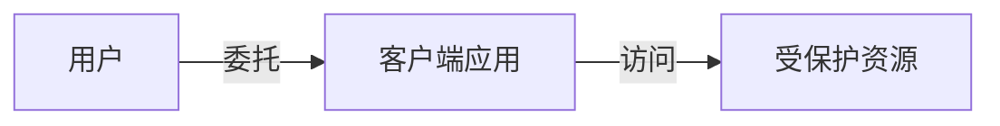

> 学习.NET Core权限认证相关知识，看的是杨旭老师在B站上的教程，先开始了解OAuth 2.0协议

## 什么是OAuth 2.0协议

OAuth 2.0协议是一种**委托协议**，可以让那些控制资源的人允许某个应用**代表**他们来访问他们控制的资源。这个应用从资源的所有者那里获得*授权(Authorization)*和*access token*，随后就可以用这个*access token*来访问资源

这里有两点值得注意的，其一，OAuth 2.0是一种委托协议，什么叫做委托协议呢

**委托协议**

上面的客户端应用可以是WPF，ASP.NET Core MVC等客户端项目，受保护的资源可以是受到保护的ASP.NET Core Web API，当然这里只是举例，主要想说的是对委托协议这个词的解释，一个用户想要访问一些数据资源或者一些功能，必须要使用客户端应用，客户端再去访问这些受保护的资源。

这里可以看到，是用户允许了客户端应用去访问这些受保护的资源，客户端代表用户去做这件事情。所以这个代表的过程，也就是委托。

注意这里不是假冒或者模仿，什么叫做假冒或者模仿呢，指的是客户端或者应用，复制了一份用户的用户名，密码等凭证，从而获得了相应的授权。在这个过程，用户的用户名，密码等信息就泄露给应用了。而我们在这里说的OAuth 2.0协议是一个委托协议，它不会假冒或者模仿用户，所以客户端并没有得到用户的用户名和密码或其他凭证。这样做是比较合理的，因为有的客户端应用，我们是不一定会信任它的。

**授权和认证**

OAuth 2.0协议只是用来做授权的协议，授权的意思就是授予各种应用进行某些操作的权力，它无法做身份认证，身份认证的意思就是让访问的资源知道你是谁，关于这点我们通过OpenId Connect协议实现

|      | 授权       | 认证           |
| ---- | ---------- | -------------- |
| 协议 | OAuth 2.0  | OpenId Connect |
| 含义 | 你能干什么 | 你是谁         |

