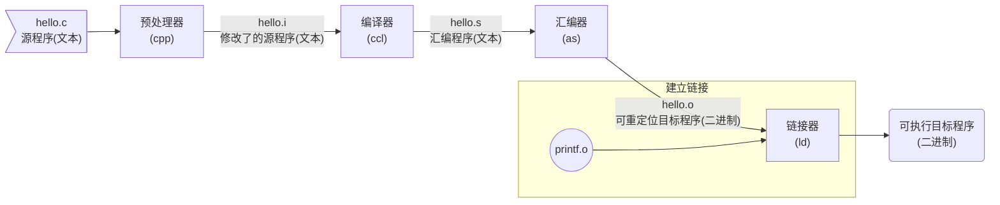

> 每日的学习笔记，主要用来发布前一天学习的所有理论知识，即每天早上8点30之后可以随时在这里看到之前的一天学习的内容有哪些，也可以看[提交记录](https://github.com/GadHao/gadhao.github.io/commits/master)追溯之前提交过的内容

## 总结[2020.09.11]

## 《深入了解计算机系统》的学习(Page3- Page7)

---
> 书中第一章的内容主要是从一个`hello`程序开始来带领读者理解计算机系统，涉及知识点较多，继续推进，后续书中会讲解更具体的知识

> 小知识：C语言的起源 —— C语言是贝尔实验室的*Dennis Ritchie*在1969年 - 1973年之间创建的。美国国家标准学会(*American National Standards，ANSI)*在1989年颁布了ANSI C的标准，后来C语言的标准化成了国际标准化组织*International Standards Organization，ISO*)的责任。
>
> 这些标准定义了C语言和一系列函数库，即C标准库。*Kernighan*和*Ritchie*在它们的经典著作中描述了ANSI C，这本书大家满怀感情地称为"K&R"。
>
> C语言会取得成功的原因有：
>
> - **C语言与Unix操作系统关系密切**。C从一开始就是作为用于Unix系统的程序语言被开发出来的，由于20世纪70年代到80年代初Unix在高校中的流行，很多人开始接触C并且喜欢上它
> - **C语言小而简单**。C语言最初的设计是由一个人而非一个协会掌握的，因此简洁明了，没有什么冗赘的设计。这让C语言相对易于学习，也易于移植到不同的计算机
>
> C语言是系统及编程的首选，同时也很适合编写应用级程序。不过其也存在一些不足，比如容易造成程序员困惑和程序错误的C语言指针。以及缺乏对类，对象等的显式抽象能力。


### 程序被其他程序翻译成不同的格式

之前我们编写的`hello.c`程序是用高级语言来表述的，容易被人读懂。为了在系统上运行它，这些语句必须被其他程序转化为相对低级的*机器语言指令*，然后按照一种称为*可执行目标程序*的格式被打好包，并且保存为二进制磁盘文件，也被称为*可执行目标文件*

在Unix系统上，从源文件到目标文件的转换是由编译器驱动程序完成的：

```bash
linux> gcc -o hello hello.c
```

以GCC编译器驱动程序[^2]编译过程为例，整个编译分为四个阶段，而执行这四个阶段的程序共同构成了*编译系统(complilation system)*



可以看到，四个阶段分别为：

- **预处理阶段**：预处理器(cpp)根据以字符#开头的命令修改原始的C程序，比如第一行的`#include <stdio.h>`，预处理器会读取系统头文件，并且直接插入到程序文本中，得到另一个C程序，以`.i`作为扩展名

- **编译阶段**：编译器(ccl)把文本文件`hello.i`翻译成文本文件`hello.s`，其包含一个**汇编语言程序**，内容为：

  ```assembly
  main:
  	subq  $8, %rsp
  	movl  $.LCO, %edi
  	call  puts
  	movl  $0, %eax
  	addq  $8, %rsp
  	ret
  ```

  汇编语言用文本格式描述了低级机器语言指令。汇编语言的作用在于，其为不同的高级语言的不同编译器提供了通用的输出语言。
  
- **汇编阶段**：接下来，汇编器(as)把`hello.s`翻译成机器语言指令，并把指令打包成*可重定位目标程序(relocatable object program)*，保存在目标文件`hello.o`中，这是一个二进制文件，用文本编辑器打开它时，我们将看到一堆乱码

- **链接阶段**：因为`hello`程序调用了`printf`函数，它是每个C编译器都提供的标准C库中的一个函数，该函数位于一个已经预编译好了的`printf.o`文件中，所以这个文件必须以某种方式合并到我们的`hello.o`程序中，链接器(ld)负责处理这种合并。最后得到`hello`文件(在Windows系统中，通常会编译成以`.exe`为扩展名的文件)，它是一个`可执行目标文件`

> 小知识：GCC是GNU(GUN's Not Unix)项目开发出来的众多有用工具之一，这个项目是1984年由*Richard Stallman*发起的一个慈善项目。项目的目标是开发出一个完整的类Unix的系统，并且该系统的源码能不受限制地被修改和传播。GNU项目已经开发出了一个包含Unix操作系统的所有主要部件的环境，除了内核，内核是由Linux项目独立发展而来的。

学了上面的小知识，才终于知道原来Linux本身只是一个内核，但是因为Linux内核和GNU项目的软件都是成套出现的，所以就被人简称为Linux，其全称为GNU/Linux，光有一个Linux内核是没办法使用的，没有软件也没有交互。再把软件加进来还是不能用，因为这些软件都是以源代码的形式发布的，需要编译成二进制程序，而且需要做调配选择，这些工作是发行版制作者的工作。

比较异类的基于Linux内核的操作系统有Android，因为除了内核，其他运行的软件基本都是Google自己的，而不是GNU项目的；另外还有比较异类的如Debian的GNU/Hurd，其实Hurd才是GNU自己的内核，不过因为*Richard*无止境寻找完美内核，而忘记了Hurd主要目的是为了提供一个可用的操作系统内核，给了Linux机会。弄得GNU项目的人只能让自己的软件运行在Linux内核上[^3]

> GUN环境包括EMACS编辑器、GCC编译器、GDB调试器、汇编器、链接器、处理二进制文件的工具以及一些其他部件。GCC编译器已经发展到支持不同的语言，包括C、C++、Fortran、Java、Pascal、Objective-C和Ada
>
> GNU项目取得了非凡的成绩，但是却常常被忽略。现代开放源码运动(通常和Linux联系在一起)的思想起源是GNU中自由软件(free software)的概念，可想而知GNU项目对于开源的奠基地位

### 了解编译系统工作原理的好处

作为一名程序员，有许多理由不去了解编译系统是如何工作的，但我们还是有必须知道其工作原理的原因：

* **优化程序性能**：了解编译原理能让程序员在写代码时有做出更好的编码选择的能力，比如，如果了解了编译器将不同的C语言转化为机器代码的方式，就能搞清楚在实现效果一样的情况下，如何在`swich`和一连串的*if-else*之间，在`while`和`for`之间做选择。以及了解一个函数调用的开销有多大，为什么循环求和时把结果放到本地变量比放到一个通过引用传递过来的参数速度更快
* **理解链接时出现的错误**：有助于让程序员避开那些非常令人困扰的链接器操作
* **避免安全漏洞**：一个稳定的，不容易出问题的软件需要程序员具有对程序做限制的能力，不仅有业务上的一些限制，更包括程序运行时对系统资源调用的限制。学习安全编程的第一步就是理解数据和控制信息存放在程序栈上的方式会引起的后果，了解程序的内部原理有助于避免这些安全问题

### 处理器读取并解释内存中的命令

此时，我们已经有被编译系统翻译完成的`hello`文件，并被存放在磁盘上，现在我们使用名为`shell`的应用程序来运行它

```shell
linux> ./hello
hello, world
linux>
```

#### 系统的硬件组成

书里会分阶段对一个典型系统的硬件组织进行介绍，但是在这一章会带我们做一个了解，以便让我们知道运行`hello`程序时发生了什么

1. **总线**

   总线是贯穿整个系统的一组电子管道，其携带字节并负责在各个部件间传递。通常被设计成传送定长的字节块，也可以说成字(word)。其中的字节数(字长)在各个系统中都不一样，要么是4个字节(32位)，要么是8个字节(64位)

2. **I/O设备**

   I/O(输入/输出)设备是系统和外部世界的通道，之后的示例中会有四个I/O设备：键盘鼠标，显示器，磁盘。最开始，我们的这个程序就是放在磁盘上的。每个I/O设备都通过一个控制器或者适配器[^4]与I/O总线相连。


3. **主存**

   主存是一个临时存储设备，在处理器执行程序时用来存放程序和程序处理的数据。从物理上来说，其是由一组动态随机存储器(DRAM)芯片组成的。从逻辑上来说，其是一个线性的字节数组，每个字节都有唯一的地址(数组索引)，一般来说，组成程序的每条机器指令都由不同数量的字节构成。与C程序变量相对应的数据项的大小是根据类型变化的。比如，在运行Linux的x86-64机器上，`short`类型需要2个字节，`int`和`float`类型需要4个字节，而`long`和`double`类型需要8个字节

4. **处理器**

   中央处理单元(CPU)，是解释(或执行)存储在主存中指令的引擎。其核心是大小为一个字(前文在总线那里提到过这个概念)的存储设备(或寄存器)，称为程序计数器(PC)，在任何时刻，PC都指向主存中某条机器语言指令(即含有该条指令的地址)

关于处理器的具体指令集架构，即指令的执行顺序，今天已经比较晚了，明天再继续梳理


[^1]: ASCII码是用一个唯一的单字节大小的整数值来表示每个字符，还有许多其他编码方式用于表示非英语类语言文本，比如UTF-8标准，根据书中指引，本书后面会学习到
[^2]: 编译器驱动程序不止一种，相同的驱动程序在不同的系统上的行为过程大体是相同的，传统编译器的工作原理基本上都符合三段式：1.用于解析源码，检查语法错误，并将其抽象为语法树(Abstact Syntax Tree)的前端(Frontend)；2.对中间代码进行优化的优化器(Optimizer)；3.负责将优化后的中间代码转换为目标机器的机器码的后端(Backend)。现在用得比较多的LLVM编译器则与其具有一些区别，这个以后会在学习编译原理的时候学习，这里只是为了说明用GCC进行编译的过程在Unix和Windows上大体是相同的
[^3]: 关于这里有个网络上的梗：1990 年人们希望有一个可用的开源系统：Linux 可以用，Hurd 还不可以用；2000 年人们希望有一个稳定的开源系统：Linux 很稳定，Hurd 还很不稳定；2010 年人们希望有一个生态系统成熟的开源系统：Linux 生态系统很成熟，Hurd 还没有生态系统。Hurd 不成气候的原因，网友也分析出了这几点：1.RMS 的技术决定错误。微内核的优势是学术理论的结果，而不是从实际应用得出的经验。它的实现难度和设计难度也被低估，导致无法有效实施开发工作。2.和其他 GNU 项目不同，Hurd 的发展计划太长，实际执行更长。过于宏大长远的开源项目都很难成功。自由软件的成功之道是，大始于小，积土成堆。 3.GNU 没有搞出一款可用的操作系统。反而是 Redhat，Slackware，SUSE 和 Debian 这些后起之秀，短短几年就搞出了可用的开源操作系统。在此之上，前辈们迅速补齐了一个操作系统所需的各个部分，从包管理器，图形桌面到办公软件。之后人们就不再期待传说中的 GNU 操作系统了。4.GNU 的开发模式问题，虽是开源，但很集中。而 Linux 和 Mozilla 则受益于海纳百川的开放模式。可以参考《大教堂和集市》这本书。5.GNU 对自由软件的绝对洁癖。Linux 里面是有非开源的固件的，通常是由硬件厂商提供的。然而 GNU 是绝对不能认同这一实用主义做派的。因此 Hurd 如果要自己实现硬件驱动，那工作量就是无底洞，永远填不满。
[^4]: 控制器和适配器之间区别主要在于它们的封装方式。控制器是I/O设备本身或者系统的主印刷电路板(主板)上的芯片组。而适配器则是一块插在主板上的卡。无论如何，它们的功能都是在I/O总线和I/O设备之间传递信息